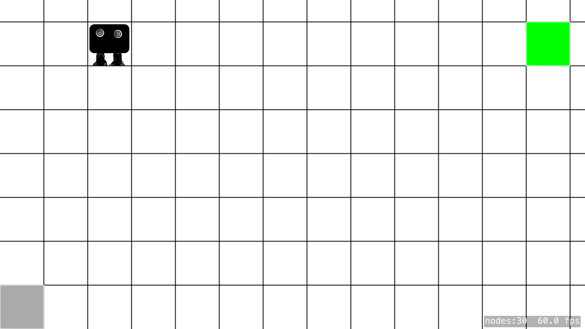

# tamagotchAI - Simple Q-Learning with Swift on iOS

tamagotchAI demonstrates the Q-Learning algorithm in a simple 2D environment where the agent has to find the best way to some target location.

## License
[MIT](https://choosealicense.com/licenses/mit/)
